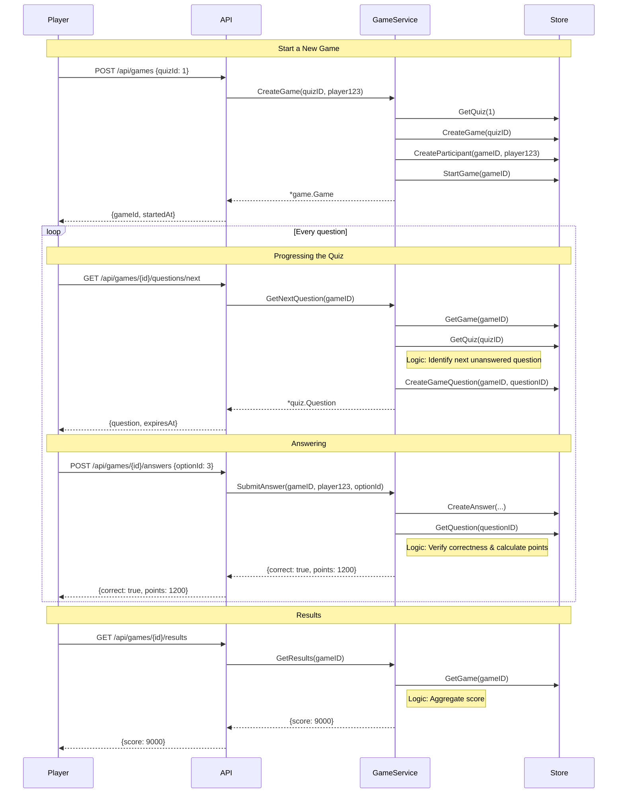

# Game logic

The player #123 has decided to play quiz #1. Selects it from the list and starts playing.

There currently is only one type of game: single player. The Game exists because later there will be multiplayer games. 
And so while we are waiting for players to join, the game state will be waiting. And when the game starts, it will be started. But for now, this all will not be implemented.
For singleplayer, the game will start automatically after creation.

## Games sequence diagram (Single player)

